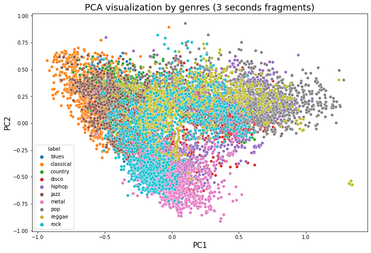

# Data and Feature Definitions

It will be a unique dataset. The source of this dataset is allocated in the website Marsyas. 
Marsyas (Music Analysis, Retrieval and Synthesis for Audio Signals) is an open source software framework for audio processing with specific emphasis on Music Information Retrieval applications.

## Raw Data Sources

| Dataset Name | Original Location   | Destination Location  | Data Movement Tools / Scripts | Link to Report |
| ---:| ---: | ---: | ---: | -----: |
| GTZAN Genre Collection | This dataset is allocated in web MARSYAS and it will be download by http://opihi.cs.uvic.ca/sound/genres.tar.gz command, that provides the webpage | This dataset will be uploaded and explored in the development phase of the project. It will be uploaded to Google Colab and there it will be handled | | |

* Dataset1 summary. The dataset consists of 1000 audio tracks each 30 seconds long. It contains 10 genres, each represented by 100 tracks. The tracks are all 22050 Hz Mono 16-bit audio files in .wav format.

## Processed Data
| Processed Dataset Name | Input Dataset(s)   | Data Processing Tools/Scripts | Link to Report |
| ---:| ---: | ---: | ---: | 
| Processed Dataset 1 | GTZAN Genre Collection | Preprocesamiento_Audio.ipynb | |

* Processed Data1 summary. <The Processed Dataset consists in an audio-to-image transformation in order to create an input for a CNN.>

## Feature Sets

The classifier model will be constructed by means of a convolutional neural network. Therefore there is not an specific feature set for feeding such model.

However, as a theoretical exercise, we perform an exploration of the numerical and image-based characteristics provided by the elaborated [GTZAN dataset (kaggle)](https://www.kaggle.com/andradaolteanu/gtzan-dataset-music-genre-classification)  which is based on the original MARSYAS datset. 

 The correlation matrix of the variables found in the feature data set is shown. It is important to mention that the characteristics have average and variance measurements and both are shown below.
  

## Image features

Additionally, an exploration of manual features descriptors was performed leveraging Oriented FAST and Rotated BRIEF (ORB) descriptor.

| Feature set Name | Input Dataset(s)   | Feature Engineering Tools/Scripts | Link to Report |
| ---:| ---: | ---: | ---: | 
| Manually extracted image features | Spectrogram data | [EDA notebook](../../scripts/eda/eda.ipynb)  ||

|  |
|:--:| 
| Features for a blues  song|

|  |
|:--:| 
| Features for a classical song|

|  |
|:--:| 
| Features for a jazz song|

|  |
|:--:| 
| Features for a pop song|

|  |
|:--:| 
| Features for a rock song|

## Signal-related features (numeric)

The kaggle datset provides a set of features from a signal processing perspective.

| Feature set Name | Input Dataset(s)   | Feature Engineering Tools/Scripts | Link to Report |
| ---:| ---: | ---: | ---: | 
| Signal features 1 | feature_3sec.csv | [EDA-signal notebook](../../scripts/eda/eda-signal.py) ||
| Signal features 2 | feature_30sec.csv | [EDA-signal notebook](../../scripts/eda/eda-signal.py)||

The following plots show the correlation behavior between signal-related features:

### Signal features 1 (3 seconds audio clips) 

### Signal features 2 (30 seconds audio clips) 

#### Correlation matrix for mean-related features

#### BPM behavior

#### 2D data visualization

